# Ascend physical machine installation Cann and MindSpore environment guidance


# Pre -reading and resource preparation

1. Log in to the fortress machine or physical machine of the Shengteng chip

Log in to a fortress machine needs to contact the administrator to get the corresponding resources

2. Download the dependency package in advance (see the correspondence and download address below for the version of the version)
- Ubuntu 20.04 ISO installation package
- Cann and its kernel
- Anaconda installation supporting MindSpore environment

## VPN opens the network of the fortress machine

(1). VPN connecting the Shengteng community can access the fortress machine in Hangzhou

according to [Shengteng Ecological Intelligence Laboratory Network Connection Guidance](https://gitee.com/ascend/docs-openmind/blob/master/guide/common/tutorials/%E6%98%87%E8%85%BE%E7%94%9F%E6%80%81%E4%BC%97%E6%99%BA%E5%AE%9E%E9%AA%8C%E5%AE%A4%E7%BD%91%E7%BB%9C%E8%BF%9E%E6%8E%A5%E6%8C%87%E5%AF%BC.md), Import configuration files to connect to the first layer of VPN.

If the CMD can Ping Fortress IP indicates that the network has been opened, you can use MobaxTerm to log in to the fortress machine.

(2). Dongguan-Tuanbo Waka's fortress machine also needs to connect the second layer of VPN

according to [The network environment VPN connection guidelines for Dongguan-Tuanpububi Machine](https://docs.qq.com/doc/DRXlJSU9vdWlLd25C) after completing the network environment configuration, you can log in to the fortress machine.

# IBMC installation operating system and NPU driver firmware
The basis is `npu-smi` whether the command can be executed.
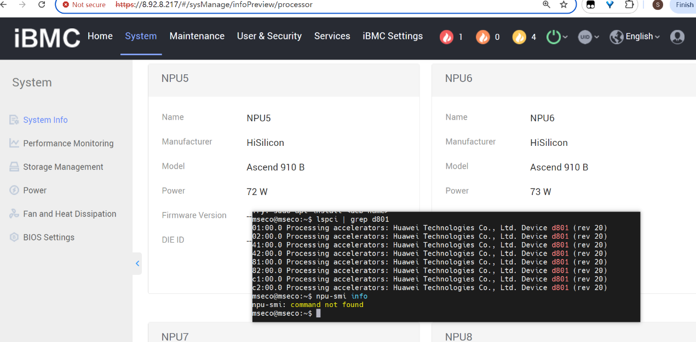 

Try to use the operating system version and the corresponding firmware that HDK teams have been developed, check the details [Official website document "Version Support Form"](https://support.huawei.com/enterprise/zh/doc/EDOC1100332523/2ff3e934) there is no guarantee outside the "Version of the Facial Form". The user needs to install the front dependencies by themselves to resolve the conflict and the source code to compile the NPU driver and firmware. As of 2024.10.11, the kernel 5.15.122-GENERIC Ubuntu22.04 source code compilation and adaptation problem, other systems are similar to similar.According to [Altas800 (9000) official tutorial installation documentation](https://www.hiascend.com/document/detail/zh/quick-installation/22.0.0/quickinstg/800_9000/quickinstg_800_9000_Arm_0002.html) it is recommended to use the operating system version corresponding to the NPU -driven firmware in the "Version of the Edition" uses binary installation. It is not recommended to install the source code.

 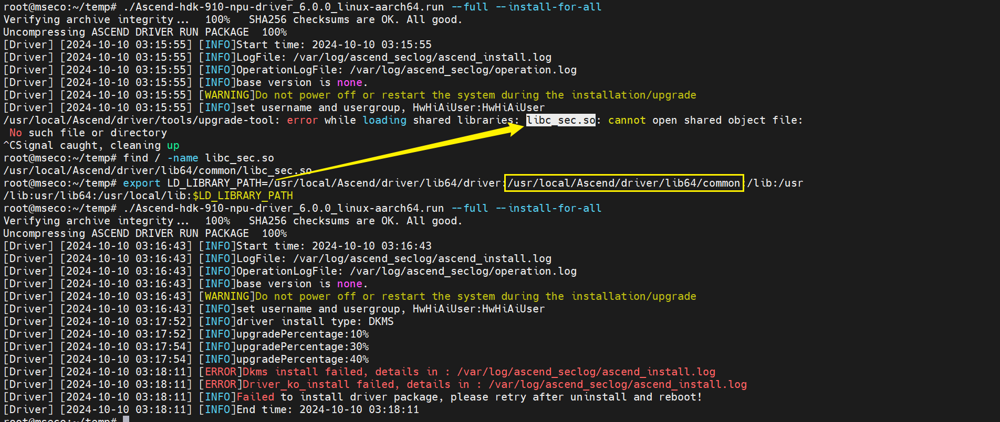 

## Recommended NPU driver and firmware on Ubuntu 20.04

### Install ubuntu20.04 operating system

Most of the installation tutorial in Ubuntu can be operated

 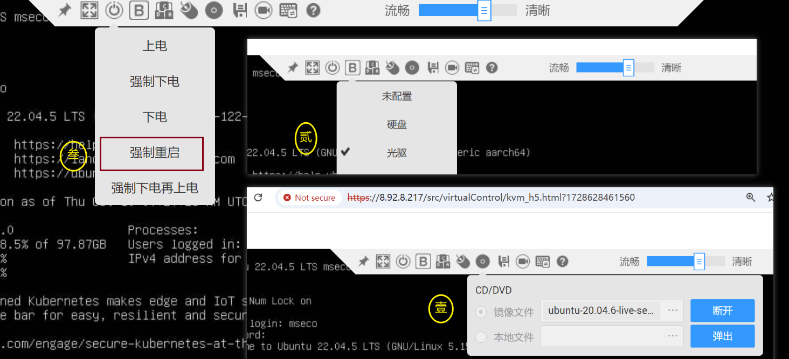 

```
sudo groupadd msecogrp
sudo useradd -g msecogrp -d /home/mseco -m mseco -s /bin/bash
sudo passwd mseco
sudo vim /etc/ssh/ssh_config
```

 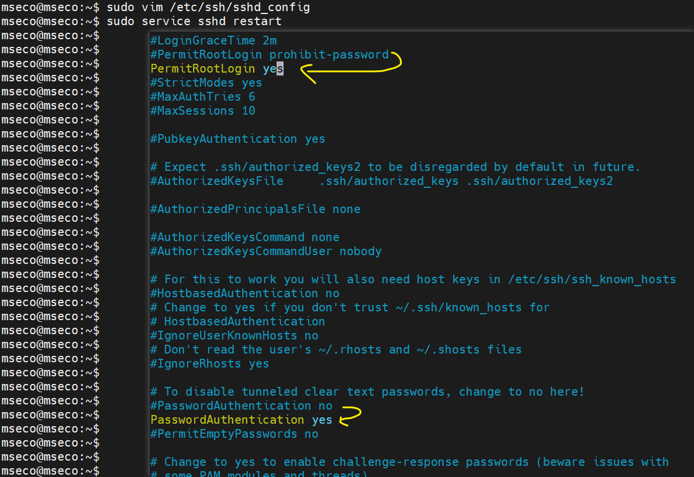 

```
sudo service ssh restart
```

After the MOBAXTERM connection

```
sudo apt upgrade -y
sudo apt update
uname -m && cat /etc/*release
uname -r
```

### Install NPU driver and firmware

IBMC can directly view the NPU model,

 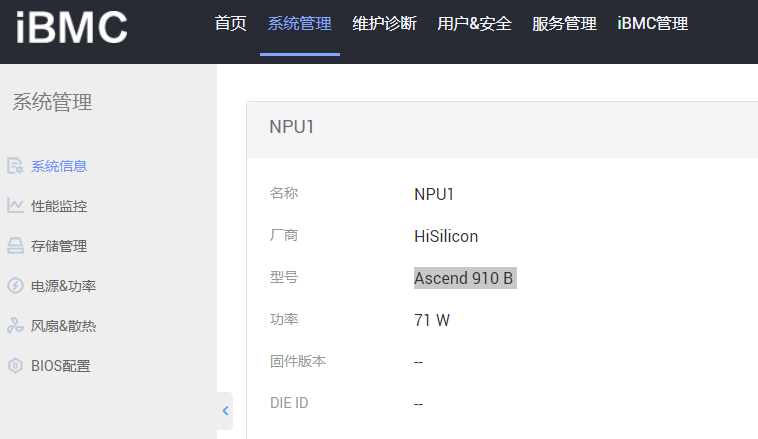 

then go to the rising page to find the corresponding version of the installation document.

```
sudo apt upgrade -y && apt update
```

The kernel version will be automatically upgraded, and the current kernel version is not adapted to the current kernel version upgrade. Therefore, the function of automatic upgrade kernel can be turned off.

```
lspci | grep d801 # 查看NPU有多少张
sudo apt-get install -y net-tools pciutils && ifconfig
sudo apt-get install -y make dkms gcc linux-headers-$(uname -r)
groupadd HwHiAiUser
useradd -g HwHiAiUser -d /home/HwHiAiUser -m HwHiAiUser -s /bin/bash
chmod +x ./Ascend-hdk-910-npu-driver_6.0.0_linux-aarch64.run
sudo ./Ascend-hdk-910-npu-driver_6.0.0_linux-aarch64.run --full --install-for-all
chmod ./Ascend-hdk-910-npu-firmware_6.0.0.run
sudo ./Ascend-hdk-910-npu-firmware_6.0.0.run --full
reboot # 重启令驱动固件生效
```

 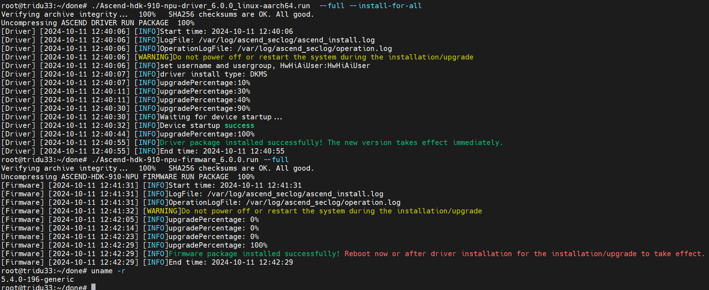 

 `npu-smi info` report an error, according to the tutorial <https://bbs.huaweicloud.com/blogs/423686>
Set white

 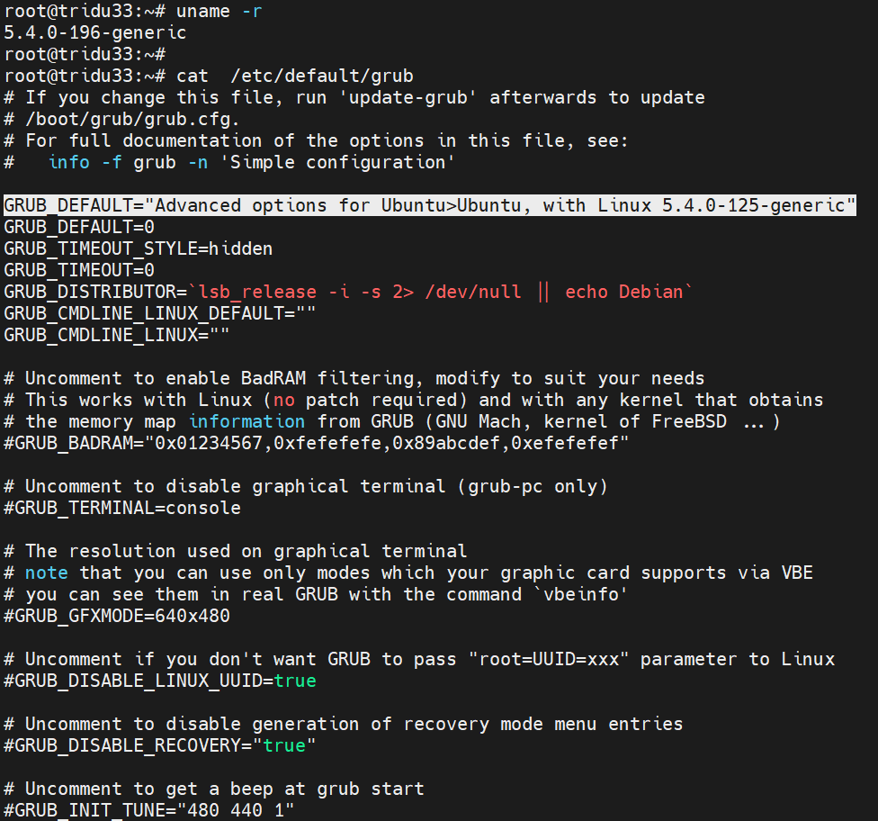 

Then restart

  

This shows that there is no problem with the driver, you can continue to check

```
lsmod | grep drv
msnpureport -f
```

## Supporting Cann and Kernel

Establishing necessary dependent components

```
sudo apt install -y nano gcc g++ make cmake zlib1g zlib1g-dev openssl
libsqlite3-dev libssl-dev libffi-dev unzip pciutils net-tools
libblas-dev gfortran libblas3
chmod +x Ascend-cann-toolkit_6.0.1_linux-aarch64.run
./Ascend-cann-toolkit_6.0.1_linux-aarch64.run --install --install-for-all
```

After the installation, you can print the environment variables to see if the value is written correctly. If not, you need to write it yourself `~/.bashrc` or `~/.zprofile` the

```bash
bash /usr/local/Ascend/ascend-toolkit/set_env.sh
```

You can install Python3.7.5 according to the tutorial, or you can install the environment of anaconda or miniconda. I use Anaconda as an example here.

```
conda create -n py37 python=3.7
mkdir -p $HOME/.pip
vim $HOME/.pip/pip.conf
```

Configure Huawei source as follows

```
[index-url = https://mirrors.huaweicloud.com/repository/pypi/simple]
[trusted-host = mirrors.huaweicloud.com]
[timeout = 120]
```

You can install these front tools.

```
pip install attrs cython numpy decorator sympy cffi pyyaml pathlib2
psutil protobuf scipy requests absl-py wheel typing_extensions
```

## Install MindSpore

It is recommended to use anaconda, or you can use Ubuntu native PIP+Python environment to install MindSpore.

<! ---->

1. Verify Ubuntu, Cann, MindSpore version supporting relationship

2. 2. Check [Can MindSpore use the GPU normally?](https://blog.csdn.net/Areigninhell/article/details/111683915),

the figure below is the command to check whether the NPU is used normally:

```
npu-smi info
cat /usr/local/Ascend/version.info
cat /usr/local/Ascend/ascend-toolkit/latest/aarch64-linux/ascend_toolkit_install.info
cat /usr/local/Ascend/ascend-toolkit/latest/opp/built-in/op_impl/ai_core/tbe/kernel/version.info
python -c "import acl;" 
cat /usr/local/Ascend/firmware/version.info
cat /usr/local/Ascend/driver/version.info
pip list | grep mindspore
```

 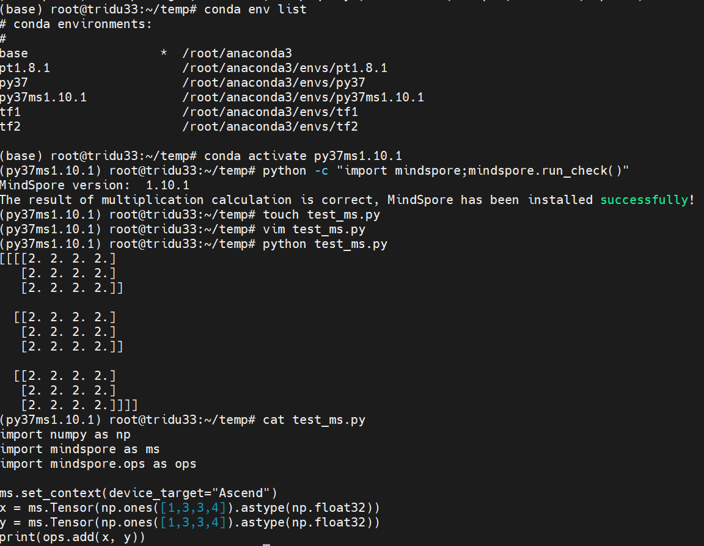 

'Device_target' parameters are \ ['cpu', 'gpu', 'ascend', 'davinci' \], Davinci is the old name of Ascend.

## Q & A

1) When the third -party SSH client logs in Linux instance, it prompts "Access denied" the reason why the error is possible:
- SSH login account password input error;

- MacBook or Windows keyboard layout or input method of lax and special character transition causes password errors.
  
  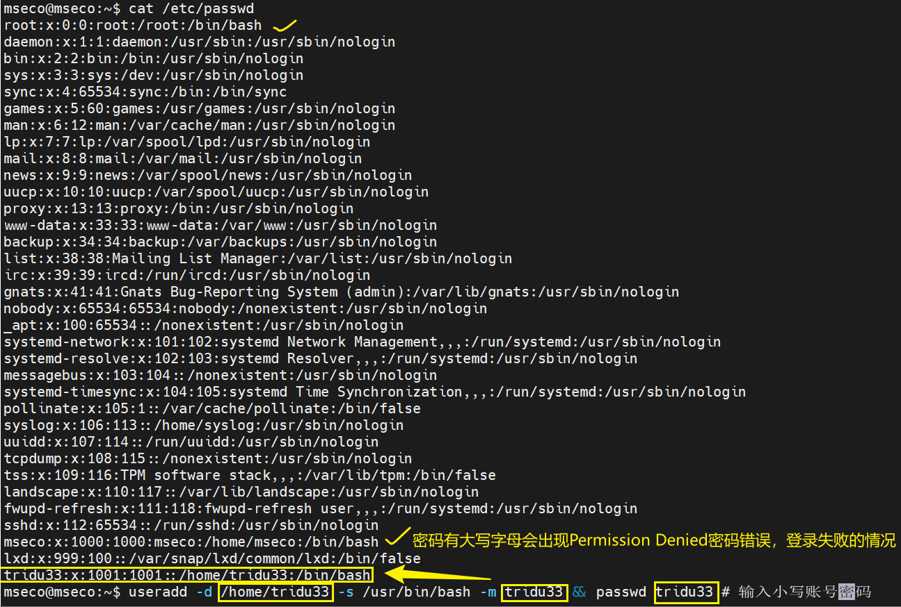 

try `sudo passwd root` set a simple password to try whether to log in;

- SSH_CONFIG configuration is not set correctly
  
   
2) After installing Ubuntu

Without the correct setting of the network, refer to the IBMC network configuration when it is recommended to reinstall OS. Correctly set the network card:

 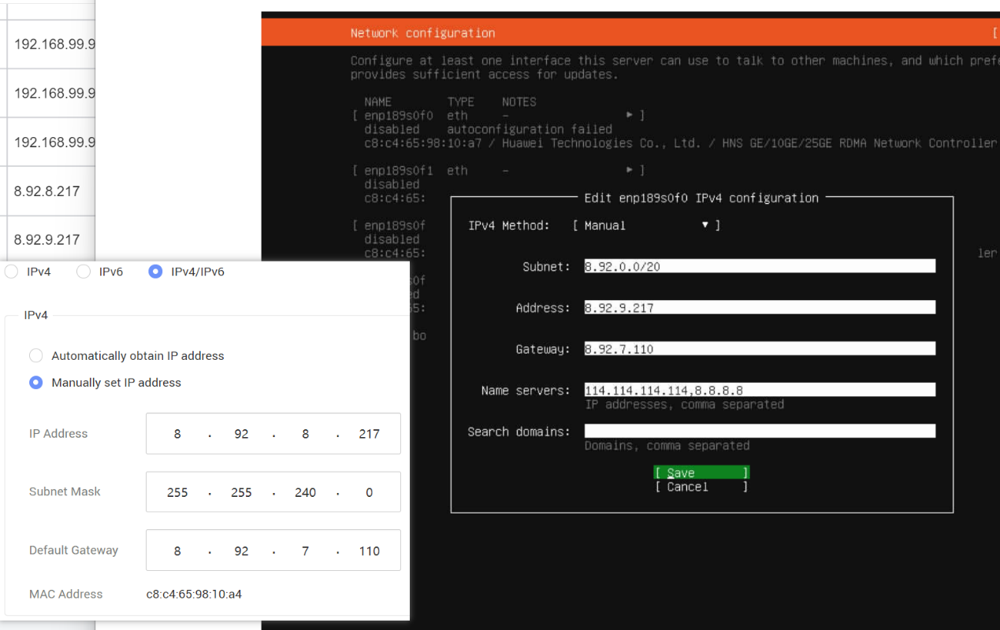 

After turning on, you can check whether the IP of the network card is set correctly

 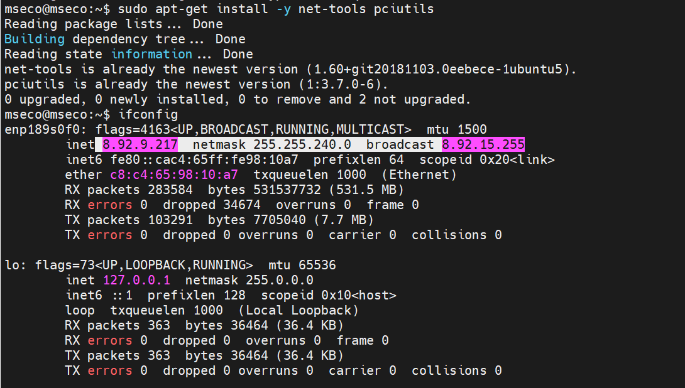 

3) Remote development
Try to install [Code-Server](https://zhuanlan.zhihu.com/p/497224440), or use Pycharm remote development.
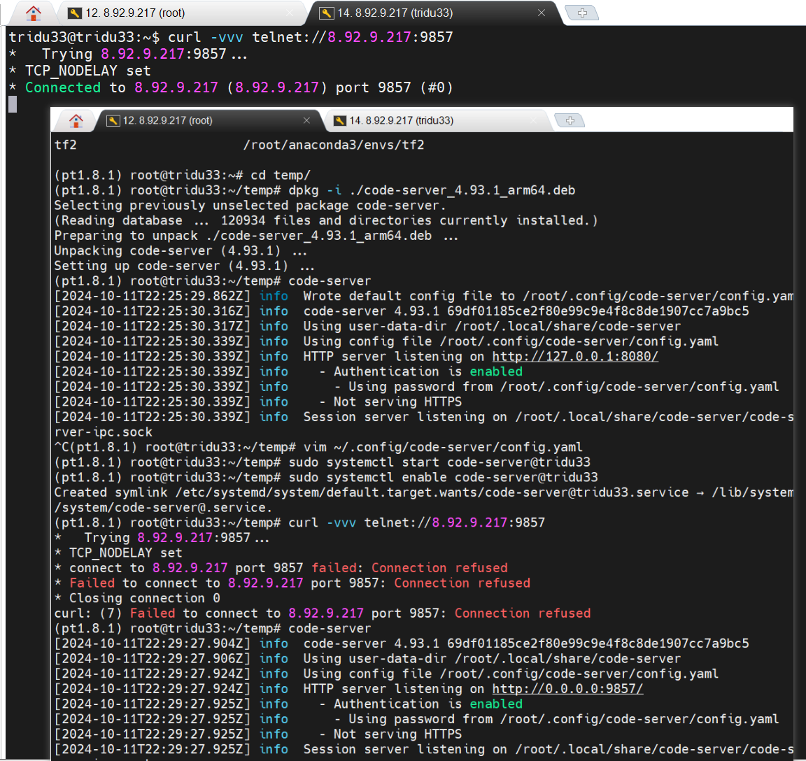 
At this time, the local can be connected and developed remote Visual Code

 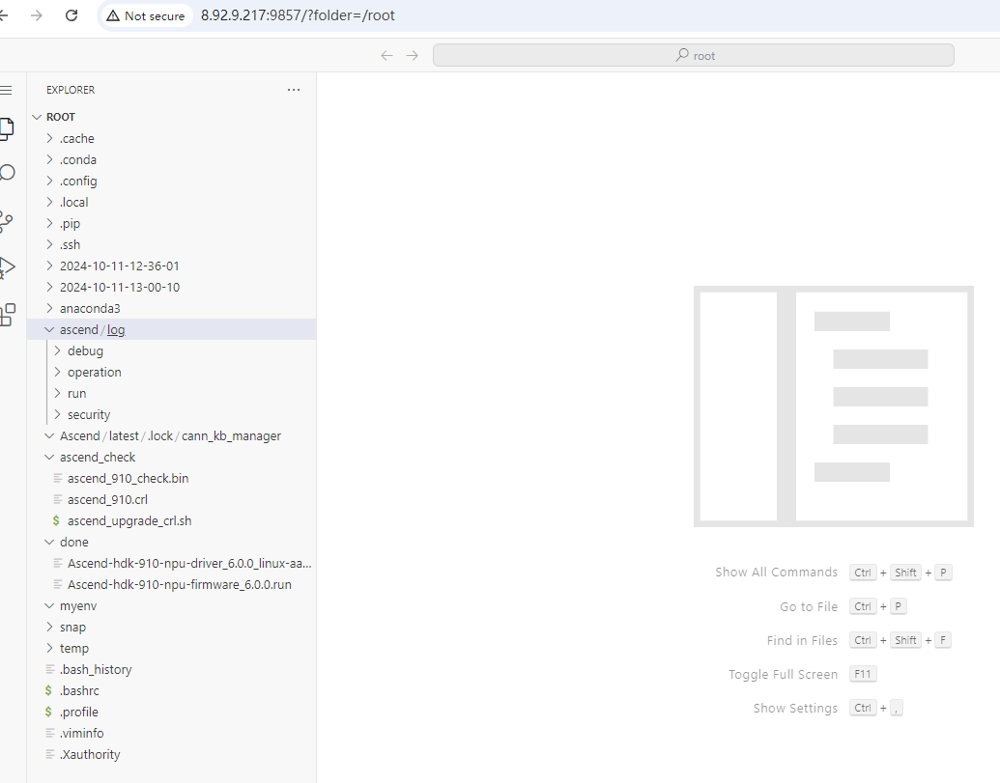 

Do not set the SystemCTL automatic background startup (it will automatically restart many background services), every time Mobaxterm is used in TMUX, manually enter `code-server` local development.**Not recommended "Version Supporting Table" Os Outside OS Source Code Compile NPU Driver and firmware**.