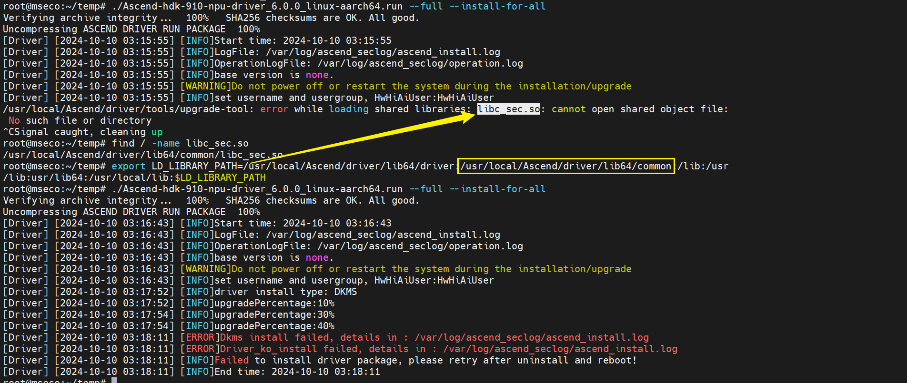
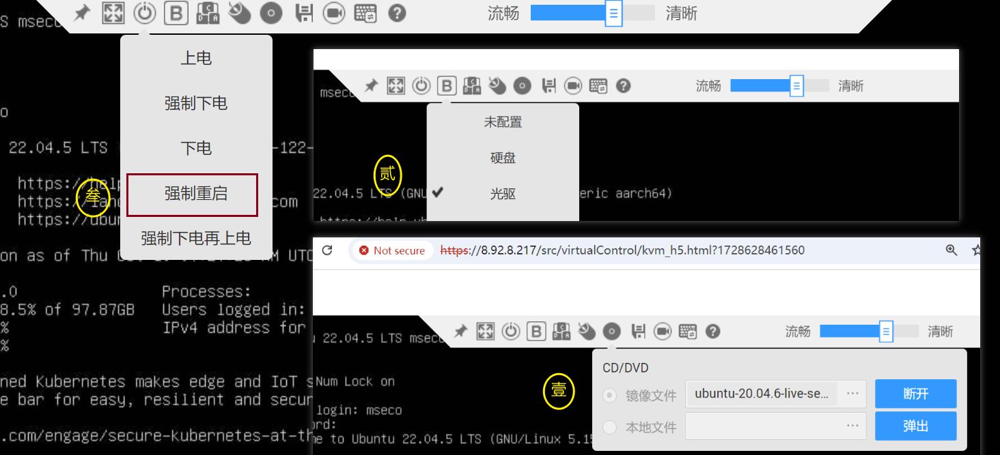
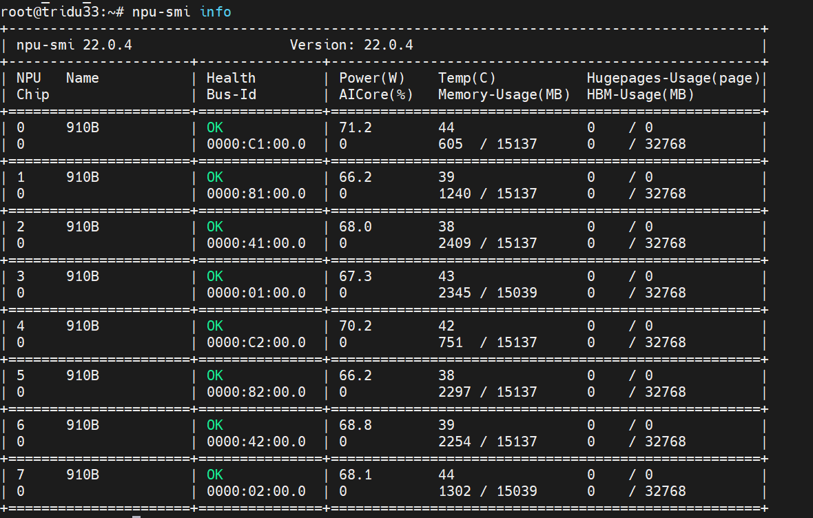
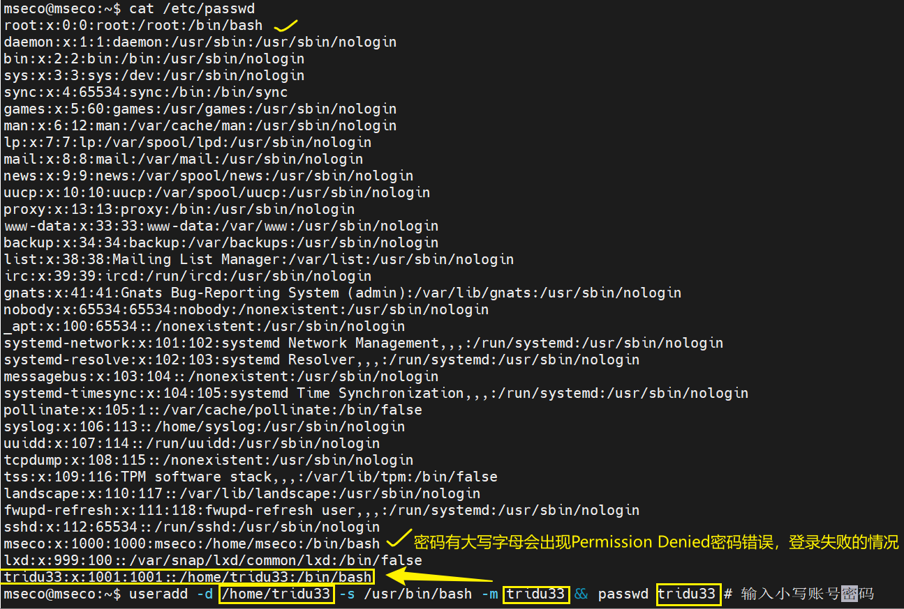
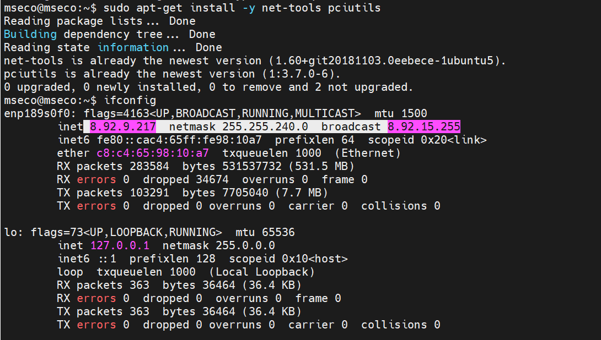
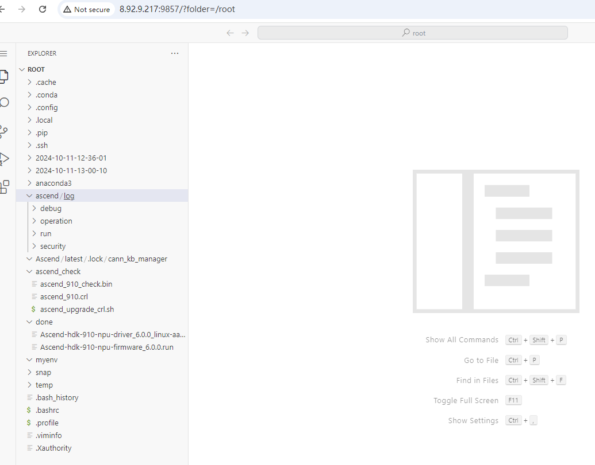

# Ascend物理机安装CANN和MindSpore环境指导


# 前置阅读和资源准备

1. 登录昇腾芯片的堡垒机或者物理机

登录堡垒机需要联系管理员获取相应资源

2. 提前下载依赖包(版本对应关系和下载地址见下文)
- Ubuntu 20.04 iso安装包
- CANN及其kernel
- Anaconda安装配套MindSpore环境

## VPN打通堡垒机的网络

(1) . 连接昇腾社区的VPN即可访问杭州的堡垒机

根据[昇腾生态众智实验室网络连接指导](https://gitee.com/ascend/docs-openmind/blob/master/guide/common/tutorials/%E6%98%87%E8%85%BE%E7%94%9F%E6%80%81%E4%BC%97%E6%99%BA%E5%AE%9E%E9%AA%8C%E5%AE%A4%E7%BD%91%E7%BB%9C%E8%BF%9E%E6%8E%A5%E6%8C%87%E5%AF%BC.md)，导入配置和根据管理员给的资源连接第一层VPN。

如果cmd能够ping 堡垒机IP 说明网络已打通，可以使用MobaXterm登录堡垒机。

(2) . 东莞-团泊洼的堡垒机还需连接第二层VPN

根据[东莞-团泊洼堡垒机的网络环境VPN连接指引](https://docs.qq.com/doc/DRXlJSU9vdWlLd25C)完成网络环境配置,即可登录堡垒机。

# iBMC安装操作系统和NPU驱动固件
检查依据是`npu-smi`命令能否执行。


尽量使用hdk团队已经调通的操作系统版本和对应的固件，详情查看[官网文档《版本配套表》](https://support.huawei.com/enterprise/zh/doc/EDOC1100332523/2ff3e934)，《版本配套表》外不做保证，需要用户自行安装前置依赖，解决冲突并源码编译NPU驱动和固件。截止到2024.10.11，内核5.15.122-generic的Ubuntu22.04源码编译还有适配问题，其他系统对照关系类似。
按照[Altas800(9000)官方教程安装文档](https://www.hiascend.com/document/detail/zh/quick-installation/22.0.0/quickinstg/800_9000/quickinstg_800_9000_Arm_0002.html)，推荐使用《版本配套表》中NPU驱动固件对应的操作系统版本使用二进制安装，不推荐源码安装。



## 推荐Ubuntu20.04上配套NPU驱动和固件

### 安装Ubuntu20.04操作系统

大部分按照Ubuntu安装教程操作即可



```
sudo groupadd msecogrp
sudo useradd -g msecogrp -d /home/mseco -m mseco -s /bin/bash
sudo passwd mseco
sudo vim /etc/ssh/ssh_config
```


```
sudo service ssh restart
```

mobaXterm连接之后

```
sudo apt upgrade -y
sudo apt update
uname -m && cat /etc/*release
uname -r
```

### 安装NPU驱动和固件

iBMC可以直接查看NPU型号，


然后去昇腾页面寻找对应版本安装文档即可。

```
sudo apt upgrade -y && apt update
```

会自动升级内核版本，由于内核版本升级导致当前内核版本未适配驱动。因此可以关闭自动升级内核的功能。

```
lspci | grep d801 # 查看NPU有多少张
sudo apt-get install -y net-tools pciutils && ifconfig
sudo apt-get install -y make dkms gcc linux-headers-$(uname -r)
groupadd HwHiAiUser
useradd -g HwHiAiUser -d /home/HwHiAiUser -m HwHiAiUser -s /bin/bash
chmod +x ./Ascend-hdk-910-npu-driver_6.0.0_linux-aarch64.run
sudo ./Ascend-hdk-910-npu-driver_6.0.0_linux-aarch64.run --full --install-for-all
chmod ./Ascend-hdk-910-npu-firmware_6.0.0.run
sudo ./Ascend-hdk-910-npu-firmware_6.0.0.run --full
reboot # 重启令驱动固件生效
```


`npu-smi info` 报错，根据教程<https://bbs.huaweicloud.com/blogs/423686>
设置白色这行


然后重启



这样说明驱动没有问题，还可以继续检查下

```
lsmod | grep drv
msnpureport -f
```

## 配套CANN和kernel

安装必备依赖组件

```
sudo apt install -y nano gcc g++ make cmake zlib1g zlib1g-dev openssl
libsqlite3-dev libssl-dev libffi-dev unzip pciutils net-tools
libblas-dev gfortran libblas3
chmod +x Ascend-cann-toolkit_6.0.1_linux-aarch64.run
./Ascend-cann-toolkit_6.0.1_linux-aarch64.run --install --install-for-all
```

安装完可以打印环境变量看看值是否正确写入。没有的话，需要自己写入一下到`~/.bashrc`或`~/.zprofile`：

```bash
bash /usr/local/Ascend/ascend-toolkit/set_env.sh
```

可以根据教程安装python3.7.5也可以安装Anaconda或者miniconda创建py37的环境，我这里使用Anaconda举例

```
conda create -n py37 python=3.7
mkdir -p $HOME/.pip
vim $HOME/.pip/pip.conf
```

配置华为源如下

```
[index-url = https://mirrors.huaweicloud.com/repository/pypi/simple]
[trusted-host = mirrors.huaweicloud.com]
[timeout = 120]
```

可以安装这些前置工具。

```
pip install attrs cython numpy decorator sympy cffi pyyaml pathlib2
psutil protobuf scipy requests absl-py wheel typing_extensions
```

## 安装MindSpore

推荐使用Anaconda，也可以用Ubuntu原生pip+python环境安装MindSpore。

<!-- -->

1. 验证Ubuntu、CANN、MindSpore版本配套关系

2. 检查[MindSpore能否正常使用GPU](https://blog.csdn.net/Areigninhell/article/details/111683915),

下图是检查NPU是否正常使用的命令：

```
npu-smi info
cat /usr/local/Ascend/version.info
cat /usr/local/Ascend/ascend-toolkit/latest/aarch64-linux/ascend_toolkit_install.info
cat /usr/local/Ascend/ascend-toolkit/latest/opp/built-in/op_impl/ai_core/tbe/kernel/version.info
python -c "import acl;"
cat /usr/local/Ascend/firmware/version.info
cat /usr/local/Ascend/driver/version.info
pip list | grep mindspore
```


'device_target'参数有 \['CPU', 'GPU', 'Ascend','Davinci'\]这几种情况，Davinci是Ascend旧叫法。

## Q&A

1) 第三方SSH客户端登录Linux实例时，提示"Access denied"错误可能的原因：
- SSH登陆账号的密码输入错误；

- MacBook或者Windows键盘布局或者输入法的大小写和特殊字符转义导致密码错误，



尝试`sudo passwd root`设置简单密码先试试能否登录；

- ssh_config配置没有正确设置


2) 安装Ubuntu之后能ping通iBMC IP无法ping通物理机ip

没有正确设置网络，推荐重装OS时参照iBMC网络配置，正确设置网卡：


开机之后可以检查网卡的ip是否正确设置



3) 远程开发有点麻烦，尝试安装code-server

<https://zhuanlan.zhihu.com/p/497224440>


此时本地就能远程visual code连接并开发



不要设置systemctl自动后台启动（会自动重启很多个后台服务），每次用的时候mobaxterm在tmux会话手动输入`code-server`本地开发即可。**不推荐《版本配套表》外OS上源码编译NPU驱动和固件**.
